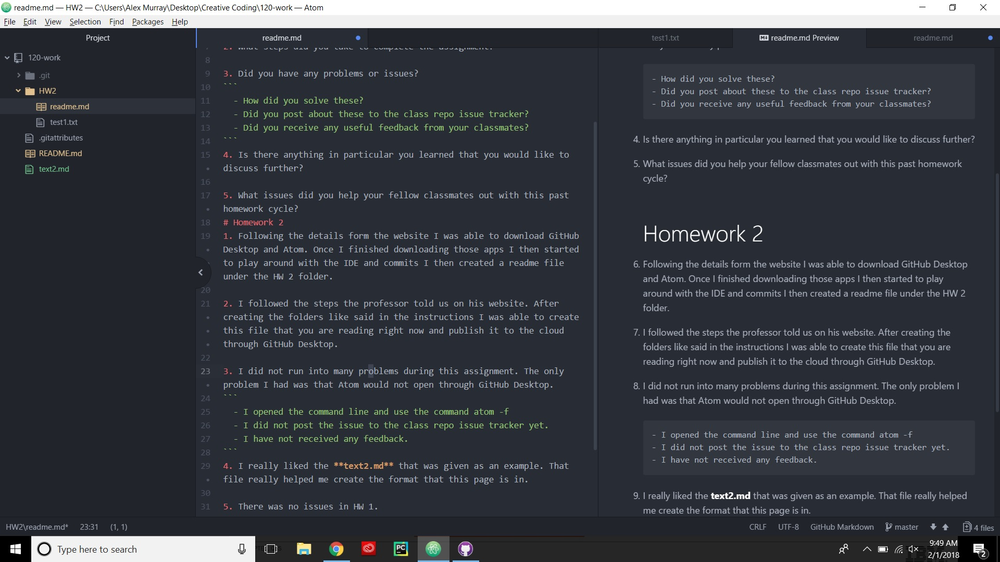

Alex Murray
# Weekly Questions

## The questions you should address in ever week's response are;
1. Summarize the work you did this homework cycle. Paying particular attention to the individual choices you made.

2. What steps did you take to complete the assignment?

3. Did you have any problems or issues?
```
  - How did you solve these?
  - Did you post about these to the class repo issue tracker?
  - Did you receive any useful feedback from your classmates?
```
4. Is there anything in particular you learned that you would like to discuss further?

5. What issues did you help your fellow classmates out with this past homework cycle?
# Homework 2
1. Following the details form the website I was able to download GitHub Desktop and Atom. Once I finished downloading those apps I then started to play around with the IDE and commits I then created a readme file under the HW 2 folder.

2. I followed the steps the professor told us on his website. After creating the folders like said in the instructions I was able to create this file that you are reading right now and publish it to the cloud through GitHub Desktop.

3. I did not run into many problems during this assignment. The only problem I had was that Atom would not open through GitHub Desktop.
```
  - I opened the command line and use the command atom -f
  - I did not post the issue to the class repo issue tracker yet.
  - I have not received any feedback.
```
4. I really liked the **text2.md** that was given as an example. That file really helped me create the format that this page is in.

5. There was no issues in HW 1.

## Link to UMT
[Link to My UMT](http://my.umt.edu/students)

## Image of my editor

