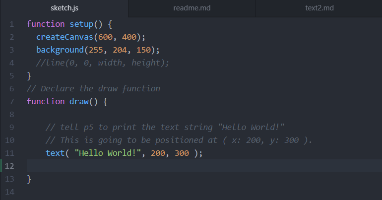

Alex Murray

[Link to my sketch- 'Hello World!'](https://a25murray.github.io/120-work/HW3/)

# Week 3- Creative Coding

  During my work over the last week I learned a lot. I liked the way that the course website really laid out what processes were going on in the background to create the program. Listed below are three takeaways I had while completing the homework this week:

  1. Understand what the p5 library is and what it is capable of.
  2. Understand what functions are and why they are useful and necessary.
  3. Understand that comments are a very useful tool to keep you and other on the same page.

I took many steps while creating this assignment. First I downloaded the example from the website and look at the contents that were in that folder.

Secondly, I renamed the folder to HW3 and got to work creating functions to set up a canvas to display the text: 'Hello World!'. In my program I made sure to create some comments just in case I got lost I could recall what I was doing. Below is the code that I used to create the image:

Lastly, I committed my repo to Github.com and used the index.html to create a  [viewable](https://a25murray.github.io/120-work/HW3/) webpage that runs my program.

## Issues

  I am still getting used to committing things to github.com, sometimes it works and sometimes it does not. Because there is no debug feature for this I am looking at forums to help me though this issue which has helped a lot.

  Since I am still new at this, I do not feel like I have the understanding to help other students yet.
